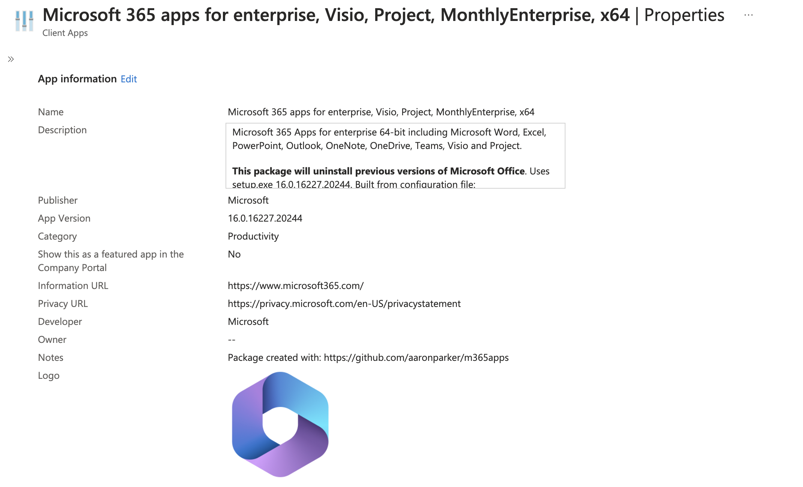
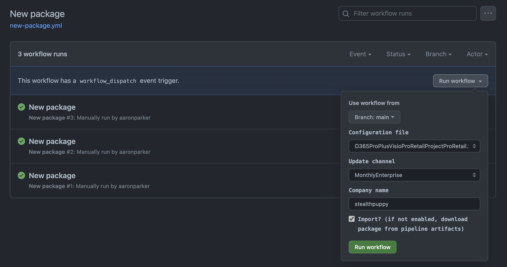

# Microsoft 365 Apps packager for Intune

A PowerShell script and GitHub Actions workflow for creating a Microsoft Intune package for the Microsoft 365 Apps.



## Configuration Files

Microsoft 365 Apps configuration files are included in this repository - these files can be used to create packages for any target tenant as some key options will be updated dynamically by this solution. 

* `O365BusinessRetail.xml` - Configuration file for Microsoft 365 Apps for business
* `O365BusinessRetail-VDI.xml` - Configuration file for Microsoft 365 Apps for business with shared licensing enabled, and OneDrive and Teams excluded
* `O365ProPlus.xml` - Configuration file for Microsoft 365 Apps for enterprise
* `O365ProPlus-VDI.xml` - Configuration file for Microsoft 365 Apps for enterprise with shared licensing enabled, and OneDrive and Teams excluded
* `O365ProPlusVisioProRetailProjectProRetail.xml` - Configuration file for Microsoft 365 Apps for enterprise, Visio, and Project
* `O365ProPlusVisioProRetailProjectProRetail-VDI.xml` - Configuration file for Microsoft 365 Apps for enterprise, Visio, and Project with shared licensing enabled, and OneDrive and Teams excluded
* `Uninstall-Microsoft365Apps.xml` - A configuration that will uninstall all Microsoft 365 Apps

When the package is generated, the following properties will be updated:

* Company name
* Tenant id
* Channel

## Scripts

* `New-Microsoft365AppsPackage.ps1` - Creates and imports a Microsoft 365 Apps package into Intune via GitHub Actions or from a local copy of this repository
* `Create-Win32App.ps1` imports the intunewin package into the target Intune tenant, using `App.json` as the template. Called by `New-Microsoft365AppsPackage.ps1`
* `scrub` - Office Scrub Scripts, Office uninstall and scrub scripts sources from [Deploy-OfficeClickToRun](https://github.com/OfficeDev/Office-IT-Pro-Deployment-Scripts/tree/master/Office-ProPlus-Deployment/Deploy-OfficeClickToRun). These ensure that existing Office MSI or Click-to-Run packages installed on the target machine are cleanly uninstalled before installing the Microsoft 365 Apps

### Usage via Administrator Sign-in

Use `New-Microsoft365AppsPackage.ps1` by authenticating with an Intune Administrator account before running the script. Run `Connect-MSIntuneGraph` to authenticate with administrator credentials using a sign-in window or device login URL.

```powershell
Connect-MSIntuneGraph -TenantID "lab.stealthpuppy.com"
$params = @{
    Path             = "E:\project\m365Apps"
    ConfigurationFile = "E:\project\m365Apps\configs\O365ProPlus.xml"
    Channel          = "Current"
    CompanyName      = "stealthpuppy"
    TenantId         = "6cdd8179-23e5-43d1-8517-b6276a8d3189"
    Import           = $true 
}
.\New-Microsoft365AppsPackage.ps1 @params
```

### Usage via App Registration

Use `New-Microsoft365AppsPackage.ps1` to create a new package by passing credentials to an Azure AD app registration that has rights to import applications into Microsoft Intune. This approach can be modified for use within a pipeline:

```powershell
$params = @{
    Path             = "E:\project\m365Apps"
    ConfigurationFile = "E:\project\m365Apps\configs\O365ProPlus.xml"
    Channel          = "MonthlyEnterprise"
    CompanyName      = "stealthpuppy"
    TenantId         = "6cdd8179-23e5-43d1-8517-b6276a8d3189"
    ClientId         = "60912c81-37e8-4c94-8cd6-b8b90a475c0e"
    ClientSecret     = "<secret>"
    Import           = $true 
}
.\New-Microsoft365AppsPackage.ps1 @params
```

### Requirements

`New-Microsoft365AppsPackage.ps1` must be run on a supported Windows version, and has been written for PowerShell 5.1. Parameters for `New-Microsoft365AppsPackage.ps1` are:

| Parameter | Description | Required |
|:--|:--|:--|
| Path | Path to the top level directory of the m365apps repository on a local Windows machine. | No |
| ConfigurationFile | Full path to the [Microsoft 365 Apps package configuration file](https://learn.microsoft.com/en-us/deployoffice/office-deployment-tool-configuration-options). Specify the full path to a configuration file included in the repository or the path to an external configuration file. | Yes |
| Channel | A supported Microsoft 365 Apps release channel. | No. Defaults to MonthlyEnterprise |
| CompanyName | Company name to include in the configuration.xml. | No. Defaults to stealthpuppy |
| TenantId | The tenant id (GUID) of the target Azure AD tenant. | Yes |
| ClientId | The client id (GUID) of the target Azure AD app registration. | No |
| ClientSecret | Client secret used to authenticate against the app registration. | No |
| Import | Switch parameter to specify that the the package should be imported into the Microsoft Intune tenant. | No |

The app registration requires the following API permissions:

| API / Permissions name | Type | Description | Admin consent required |
|:--|:--|:--|:--|
| DeviceManagementApps.ReadAll | Application | Read Microsoft Intune apps | Yes |
| DeviceManagementApps.ReadWriteAll | Application | Read and write Microsoft Intune apps | Yes |

## New Package Workflow

Requires the following secrets on the repo:

* `TENANT_ID` - tenant ID used by `new-package.yml`
* `CLIENT_ID` - app registration client ID used by `new-package.yml` to authenticate to the target tenent
* `CLIENT_SECRET` - password used by `new-package.yml` to authenticate to the target tenent

The workflow is run on demand ([workflow_dispatch](https://docs.github.com/en/actions/managing-workflow-runs/manually-running-a-workflow)) requires input when run. This must be a configuration XML file that exists in the `configs` directory in this repository.



To use the package workflow, [clone this repository](https://docs.github.com/en/repositories/creating-and-managing-repositories/cloning-a-repository), enable GitHub Actions, and configure the [repository secrets](https://docs.github.com/en/actions/security-guides/encrypted-secrets).

## Update Binaries Workflow

[](https://github.com/aaronparker/m365apps/actions/workflows/update-binaries.yml)

This repository includes copies of the following binaries and support files that are automatically kept updated with the latest versions:

* [Microsoft 365 Apps / Office Deployment Tool](https://www.microsoft.com/en-us/download/details.aspx?id=49117) (`setup.exe`) - the key installer required to install, configure and uninstall the Microsoft 365 Apps
* [Microsoft Win32 Content Prep Tool](https://github.com/Microsoft/Microsoft-Win32-Content-Prep-Tool) (`IntuneWinAppUtil.exe`) - the tool that converts Win32 applications into the intunewin package format
* [PSAppDeployToolkit](https://psappdeploytoolkit.com/) - the install is managed with the PowerShell App Deployment Toolkit

If you have cloned this repository, ensure that you synchronise changes to update binaries to the latest version releases.
