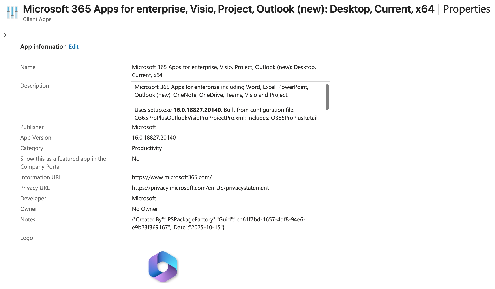

# Microsoft 365 Apps packager for Intune

A PowerShell script and GitHub Actions workflow for creating a Microsoft Intune package for the Microsoft 365 Apps.



For full details on how to use this solution see: [An Intune Package Factory for the Microsoft 365 Apps](https://stealthpuppy.com/m365apps-package-factory/).

## Configuration Files

Microsoft 365 Apps configuration files are included in this repository - these files can be used to create packages for any target tenant as some key options will be updated dynamically by this solution. 

* `O365Business.xml` - Configuration file for Microsoft 365 Apps for business
* `O365Business-VDI.xml` - Configuration file for Microsoft 365 Apps for business with shared licensing enabled, and OneDrive and Teams excluded
* `O365ProPlus.xml` - Configuration file for Microsoft 365 Apps for enterprise
* `O365ProPlus-VDI.xml` - Configuration file for Microsoft 365 Apps for enterprise with shared licensing enabled, and OneDrive and Teams excluded
* `O365ProPlusVisioProProjectPro.xml` - Configuration file for Microsoft 365 Apps for enterprise, Visio, and Project
* `O365ProPlusVisioProProjectPro-VDI.xml` - Configuration file for Microsoft 365 Apps for enterprise, Visio, and Project with shared licensing enabled, and OneDrive and Teams excluded
* `O365ProPlusOutlookVisioProProjectPro.xml` - Configuration file for Microsoft 365 Apps for enterprise, Visio, and Project. Excludes the classic Outlook application and installs the new Outlook app
* `O365ProPlusOutlookVisioProProjectPro-VDI.xml` - Configuration file for Microsoft 365 Apps for enterprise, Visio, and Project with shared licensing enabled, and OneDrive and Teams excluded. Excludes the classic Outlook application and installs the new Outlook app
* `Uninstall-Microsoft365Apps.xml` - A configuration that will uninstall all Microsoft 365 Apps

**Note** - these configurations make a couple of assumptions:

* The new Outlook is currently excluded for install with these configurations. Remove the exclusion - `<ExcludeApp ID="OutlookForWindows" />` - if you want to install the new Outlook. You can modify the configuration to exclude the classic Outlook client by updating this value to `<ExcludeApp ID="Outlook" />`
* The VDI specific configurations assume that you will install or update OneDrive and Teams separately to the Microsoft 365 Apps install

When the package is generated, the following properties will be updated:

* Company name
* Tenant id
* Channel

## Usage

* `New-Microsoft365AppsPackage.ps1` - Creates and imports a Microsoft 365 Apps package into Intune via GitHub Actions or from a local copy of this repository
* `New-Microsoft365AppsPackage.psm1` - Contains functions used by `New-Microsoft365AppsPackage.ps1`
* `scrub` - Office Scrub Scripts, Office uninstall and scrub scripts sources from [Deploy-OfficeClickToRun](https://github.com/OfficeDev/Office-IT-Pro-Deployment-Scripts/tree/master/Office-ProPlus-Deployment/Deploy-OfficeClickToRun). These ensure that existing Office MSI or Click-to-Run packages installed on the target machine are cleanly uninstalled before installing the Microsoft 365 Apps

### New-Microsoft365AppsPackage.ps1 Requirements

`New-Microsoft365AppsPackage.ps1` must be run on a supported Windows version, and has been written for PowerShell 5.1 - the IntuneWin32App module and IntuneWinAppUtil.exe require Windows.

The following modules are required: [Evergreen](https://eucpilots.com/evergreen-docs/), MSAL.PS, IntuneWin32App, PSAppDeployToolkit. Install and update with:

```powershell
Install-Module -Name "Evergreen", "MSAL.PS", "IntuneWin32App", "PSAppDeployToolkit"
Import-Module -Name "Evergreen"
Update-Evergreen
```

### Authentication

Authenticating to Intune is required before importing an package with `New-Microsoft365AppsPackage.ps1`. Use an Entra ID app registration

```powershell
$params = @{
    TenantId     = "6cdd8179-23e5-43d1-8517-b6276a8d3189"
    ClientId     = "5e9f991e-748d-4a32-818e-7ddc2cb22ee0"
    ClientSecret = "<secret>"
}
Connect-MSIntuneGraph @params
```

### App Registration Requirements

The app registration requires the following API permissions:

| API / Permissions name | Type | Description | Admin consent required |
|:--|:--|:--|:--|
| DeviceManagementApps.ReadWriteAll | Application | Read and write Microsoft Intune apps | Yes |

### Parameters

Parameters for `New-Microsoft365AppsPackage.ps1` are:

| Parameter | Description | Required |
|:--|:--|:--|
| Path | Path to the top level directory of the m365apps repository on a local Windows machine. | No |
| Destination | Path where the package will be created. Defaults to a 'package' directory under $Path. | No |
| ConfigurationFile | Full path to the [Microsoft 365 Apps package configuration file](https://learn.microsoft.com/en-us/deployoffice/office-deployment-tool-configuration-options). Specify the full path to a configuration file included in the repository or the path to an external configuration file. | Yes |
| Channel | A supported Microsoft 365 Apps release channel. | No. Defaults to MonthlyEnterprise |
| CompanyName | Company name to include in the configuration.xml. | No. Defaults to stealthpuppy |
| TenantId | The tenant id (GUID) of the target Entra ID tenant. | Yes |
| UsePsadt | Wrap the Microsoft 365 Apps installer with the PowerShell App Deployment Toolkit. When used this will include the PSADT in the package which will include scripts to uninstall earlier versions of Microsoft Office before installing the Microsoft 365 Apps | No. |
| SkipImport | Switch parameter to specify that the the package should not be imported into the Microsoft Intune tenant. | No |

### Importing packages

To import packages, specify the required parameters for `New-Microsoft365AppsPackage.ps1` including the target configuration file:

```powershell
$params = @{
    Path             = "E:\projects\m365Apps"
    ConfigurationFile = "E:\projects\m365Apps\configs\O365ProPlus.xml"
    Channel          = "Current"
    TenantId         = "6cdd8179-23e5-43d1-8517-b6276a8d3189"
    CompanyName      = "stealthpuppy"
    UsePsadt         = $true
}
.\New-Microsoft365AppsPackage.ps1 @params
```

### Package version

The version number configured on the target package is the version of the Office Deployment Tool (setup.exe), not the version of the Microsoft 365 Apps. This means that packages only need to be updated when a new version of the Office Deployment Tool is released.

### Assignments and Supersedence

Assignments and supersedence are automatically configured:

* See `scripts/App.json` and `scripts/AppNoPsadt.json` for assignments. These files can be updated to set additional or different assignments
* Supersedence is configured automatically on a matching packages when a new version is imported

## New Package Workflow

Requires the following secrets on the repo:

* `TENANT_ID` - tenant ID used by `new-package.yml`
* `CLIENT_ID` - app registration client ID used by `new-package.yml` to authenticate to the target tenent
* `CLIENT_SECRET` - password used by `new-package.yml` to authenticate to the target tenent

The workflow is run on demand ([workflow_dispatch](https://docs.github.com/en/actions/managing-workflow-runs/manually-running-a-workflow)) requires input when run. This must be a configuration XML file that exists in the `configs` directory in this repository.


To use the package workflow, [clone this repository](https://docs.github.com/en/repositories/creating-and-managing-repositories/cloning-a-repository), enable GitHub Actions, and configure the [repository secrets](https://docs.github.com/en/actions/security-guides/encrypted-secrets).

## Update Binaries Workflow

[](https://github.com/aaronparker/m365apps/actions/workflows/update-binaries.yml)

This repository includes copies of the following binaries and support files that are automatically kept updated with the latest versions:

* [Microsoft 365 Apps / Office Deployment Tool](https://www.microsoft.com/en-us/download/details.aspx?id=49117) (`setup.exe`) - the key installer required to install, configure and uninstall the Microsoft 365 Apps. Microsoft updates this tool roughly every quarter
* [Microsoft Win32 Content Prep Tool](https://github.com/Microsoft/Microsoft-Win32-Content-Prep-Tool) (`IntuneWinAppUtil.exe`) - the tool that converts Win32 applications into the intunewin package format

If you have cloned this repository, ensure that you synchronise changes to update binaries to the latest version releases.
